BẢNG KẾ HOẠCH LÀM VIỆC CỦA NHÓM
Tuần Tên công việc Người thực hiện Nhận xét của nhóm
| Tuần | Tên công việc | Người thực hiện | Nhận xét của nhóm |
|-----|----------------|------------------|-------------------|
| 1 (01–07/09) | Kick-off, xác định phạm vi, lập kế hoạch | PM, cả nhóm | Thống nhất mục tiêu, phạm vi MVP |
| 2 (08–14/09) | Khởi tạo backend (ERD, Spring Boot, DB), khung UI React | BE, FE | DB Postgres, cấu trúc API, Router FE |
| 3 (15–21/09) | Trang chi tiết sản phẩm + giỏ hàng cơ bản | FE | MUI + Redux Toolkit, bố cục Shopee-like |
| 4 (22–28/09) | Guest checkout, tài khoản (hồ sơ/địa chỉ/mật khẩu) | FE, BE | Hoàn thiện luồng "Mua ngay" (guest vs login) |
| 5 (29/09–05/10) | Đơn mua (My Orders), tạo đơn hàng | FE, BE | Hiển thị theo dõi đơn, panel thành công |
| 6 (06–12/10) | Admin dashboard, quản lý sản phẩm/đơn | BE, FE | Bảng dữ liệu, filter/pagination |
| 7 (13–19/10) | Voucher, tối ưu hiệu năng (list, ảnh) | FE, BE | Chip giảm giá, tối ưu rendering |
| 8 (20–26/10) | Bảo mật, CORS, rate limiting, uploads | BE | WebConfig, tĩnh /uploads, CORS đa cổng |
| 9 (27/10–02/11) | Unit test backend (service/repo) | BE | Test CRUD, logic đơn hàng |
| 10 (03–09/11) | Integration test API | BE | Kịch bản auth/cart/order |
| 11 (10–16/11) | E2E test frontend | QA, FE | Mua ngay, giỏ, checkout, đơn mua |
| 12 (17–23/11) | Docker hóa & Compose (db+backend+frontend) | DevOps | Compose up, cấu hình env |
| 13 (24–30/11) | CI/CD, tài liệu bàn giao, buffer cuối | DevOps, PM | Build/test/deploy GitHub Actions |

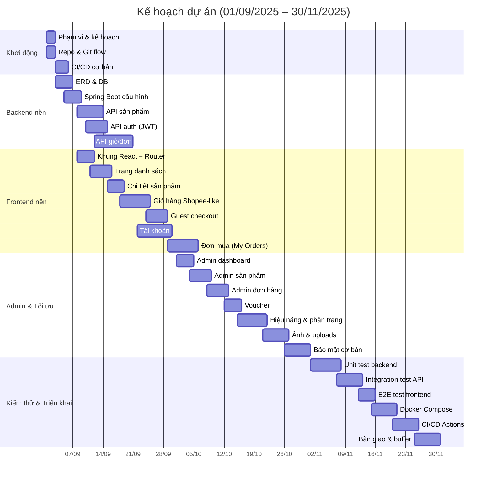

```mermaid
flowchart LR
  subgraph FE[Frontend Components]
    PD[ProductDetailPage]
    CP[CartPage]
    GC[GuestCheckoutPage]
    MO[MyOrdersPage]
    Store[[Redux cartSlice]]
  end
  subgraph BE[Backend API]
    P[/api/products/*]
    O[/api/orders/*]
    A[/api/addresses/*]
  end
  PD --> P
  CP --> P
  GC --> P
  GC --> O
  CP --> O
  MO --> O
  PD --> Store
  CP --> Store
```

Chương 1. Tổng quan dự án
1.1.Giới thiệu tổng quan dự án
ShopEase là web thương mại điện tử thời trang với các tính năng:

- Danh sách sản phẩm, chi tiết sản phẩm (giao diện tham chiếu Shopee).
- Giỏ hàng với chọn/bỏ chọn, tăng/giảm số lượng, tính tổng theo sản phẩm đã chọn.
- "Mua ngay" phân luồng: khách chuyển Guest Checkout; người dùng đăng nhập thêm vào giỏ và chuyển Giỏ hàng.
- Đặt hàng và theo dõi trong mục Đơn Mua; hiển thị panel thành công sau khi đặt.
- Quản trị: sản phẩm, đơn hàng, voucher.
- Cấu hình CORS, JWT, và tài nguyên tĩnh /uploads.

```mermaid
flowchart LR
    A["Nhấn Mua ngay"] -->|Chưa đăng nhập| B[Guest Checkout]
    A -->|Đã đăng nhập| C[Thêm vào giỏ]
    C --> D[Giỏ hàng]
    B --> E{Nhập địa chỉ\nChọn vận chuyển\nChọn thanh toán\nÁp dụng voucher}
    E --> F[Tóm tắt đơn hàng]
    F --> G[Đặt hàng]
    G --> H[Panel thành công + Mã đơn]
    H --> I[/orders - Đơn Mua]
```

1.2.Kế hoạch chi tiết của dự án
Theo WBS trong `read.md`, tiến độ từ 01/09/2025 đến 30/11/2025 với 30 hạng mục, chia theo BE/FE/QA/DevOps và có predecessors.

1.3.Lấy yêu cầu khách hàng

- Yêu cầu luồng "Mua ngay": khách phải có trang nhập địa chỉ, phương thức vận chuyển/thanh toán, voucher, tóm tắt đơn; người đã đăng nhập thì thêm vào giỏ và chuyển đến giỏ.
- Yêu cầu giao diện giỏ hàng giống ảnh tham chiếu (Shopee-like).
- Yêu cầu sửa lỗi AxiosError khi tải chi tiết sản phẩm, dọn cảnh báo linter.

  1.4.Tổng hợp yêu cầu của khách hàng

- Chức năng: danh sách/chi tiết sản phẩm, giỏ hàng, mua ngay, checkout khách, theo dõi đơn, quản trị.
- Phi chức năng: bảo mật JWT + CORS, hiệu năng danh sách, trải nghiệm UI/UX, triển khai Docker Compose.
  Chương 2.Phân tích yêu cầu
  2.1 Phân tích yêu cầu
  Hệ thống hướng tới ba nhóm người dùng với nhu cầu khác nhau (Guest/User/Admin). Phân tích tập trung vào hành trình mua sắm, thao tác giỏ hàng, đặt hàng nhanh và khả năng quản trị nội dung.
- Khách: xem danh sách, xem chi tiết, mua ngay (Guest Checkout), tạo đơn.
- Người dùng đăng nhập: thêm vào giỏ, chỉnh số lượng, đặt hàng, xem Đơn Mua.
- Admin: quản lý sản phẩm, voucher, đơn hàng.

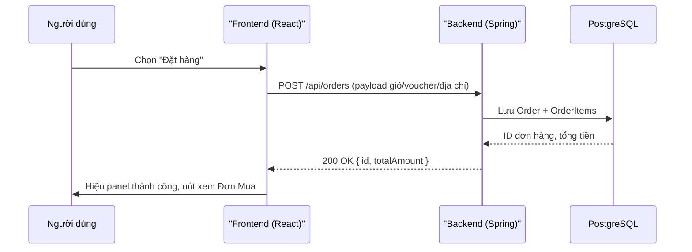

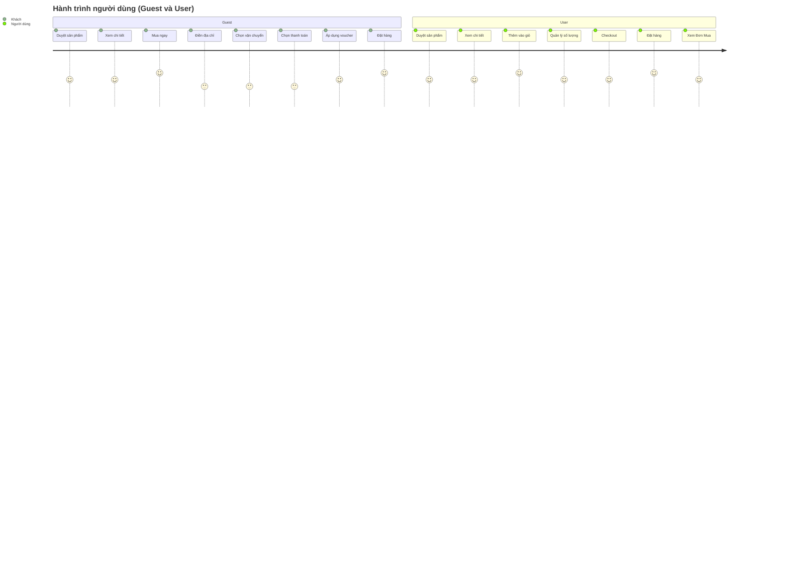

2.2 Đặc tả yêu cầu

- Sản phẩm: CRUD (admin), hiển thị cho khách, áp dụng giảm giá/voucher.
- Giỏ hàng: tăng/giảm số lượng, chọn/xóa hàng loạt, tính tổng theo chọn.
- Đơn hàng: tạo đơn từ giỏ hoặc từ mua ngay; hiển thị trạng thái; xem chi tiết.
- Tài khoản: hồ sơ, địa chỉ giao hàng mặc định, đổi mật khẩu.

  Phi chức năng (thuộc 2.2)

- Bảo mật: JWT, CORS đa cổng dev, không lộ secrets.
- Hiệu năng: phân trang, tối ưu render (MUI, tránh re-render thừa).
- Khả dụng: seed dữ liệu để demo nhanh, doc chạy nhanh sau clone.
- Triển khai: Docker Compose, CI/CD.

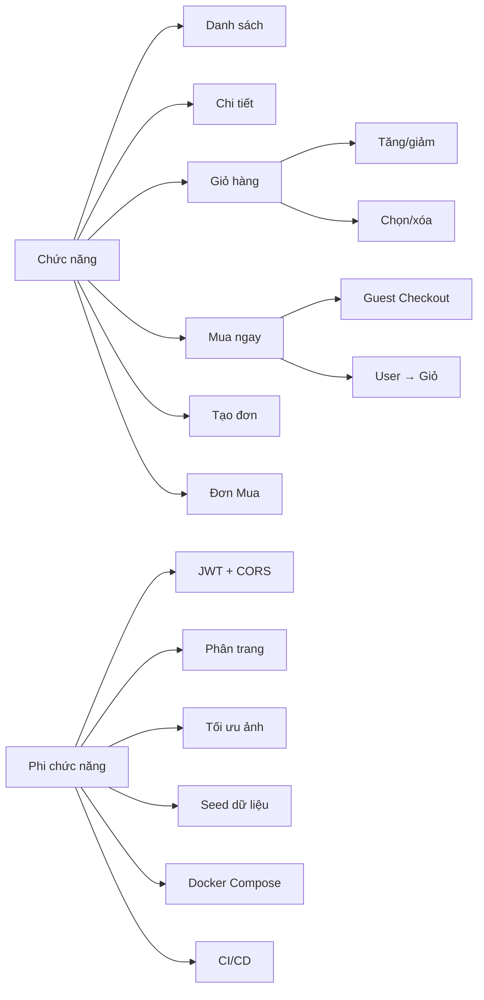

2.3 Các sơ đồ use case

```mermaid
flowchart TB
  subgraph Actors
    G[Khách (Guest)]
    U[Người dùng (User)]
    A[Quản trị (Admin)]
  end

  subgraph UserFacing[Chức năng người dùng]
    UC1((Xem danh sách))
    UC2((Xem chi tiết))
    UC3((Quản lý giỏ))
    UC4((Mua ngay))
    UC5((Tạo đơn))
    UC6((Đơn Mua))
  end

  subgraph Admin[Chức năng quản trị]
    UA1((Quản lý sản phẩm))
    UA2((Quản lý đơn hàng))
    UA3((Quản lý voucher))
  end

  G --> UC1 & UC2 & UC4
  U --> UC1 & UC2 & UC3 & UC4 & UC5 & UC6
  A --> UA1 & UA2 & UA3

  UC4 --> UC5
```

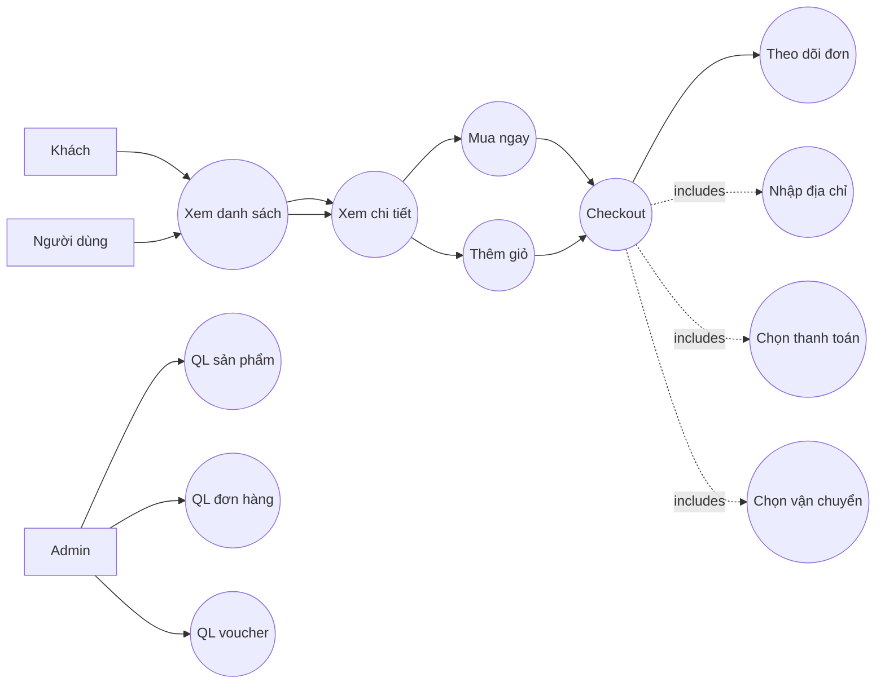

2.4 Sơ đồ ERD

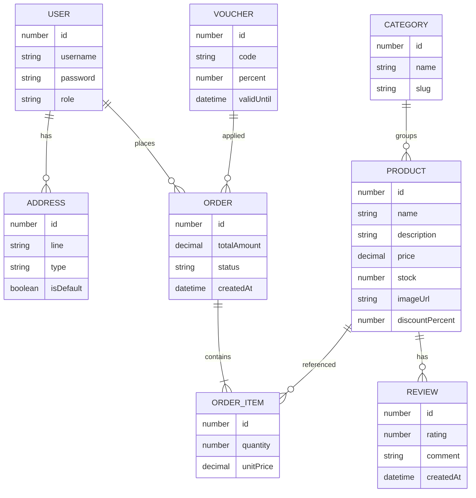

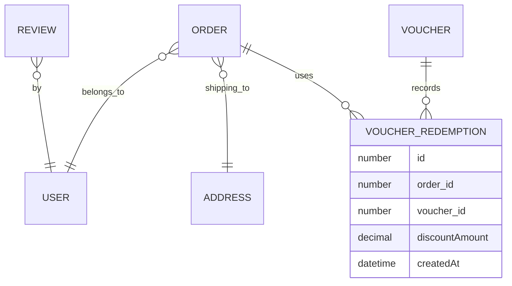

2.5 Class Diagram

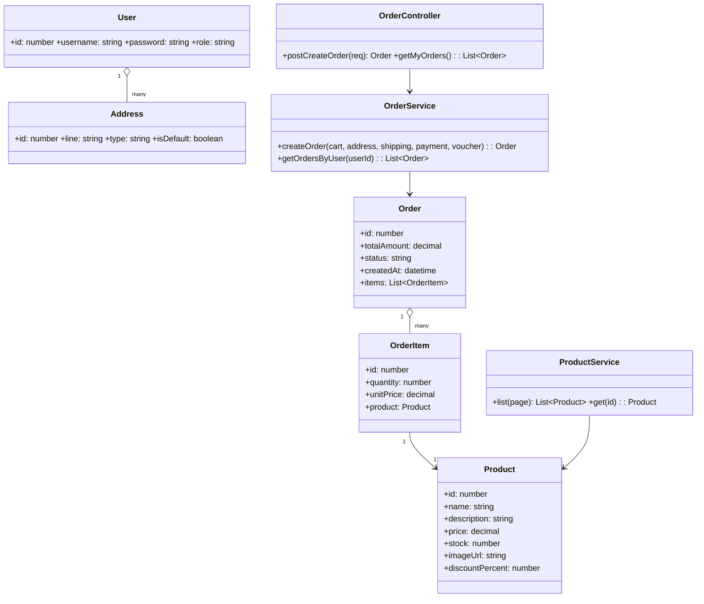

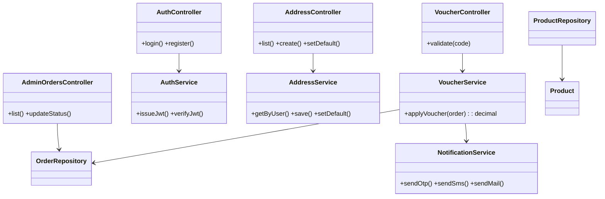

2.6 Sequence Diagram

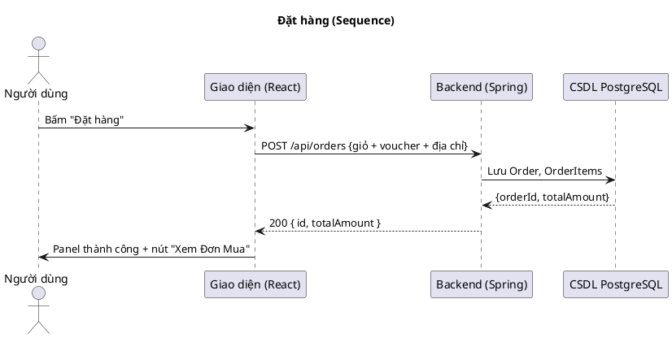

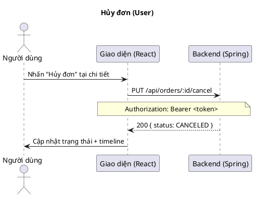

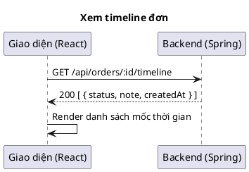

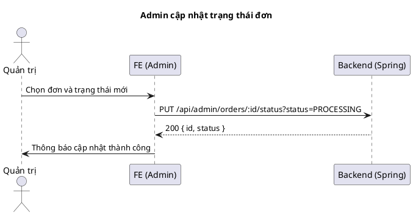

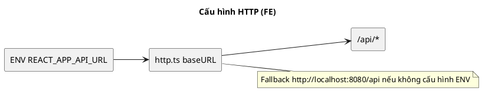

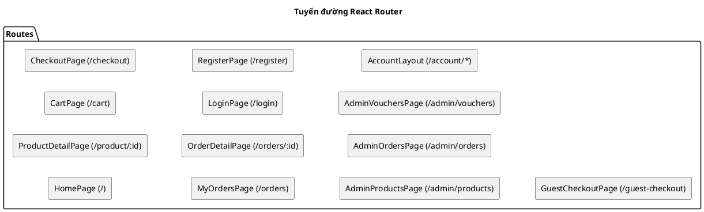

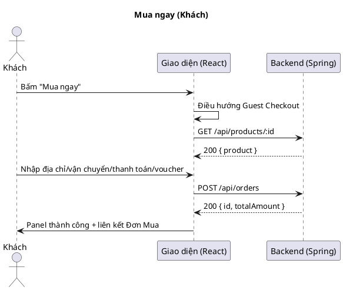

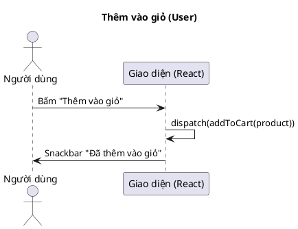

```plantuml
@startuml
title Admin tạo sản phẩm
actor "Quản trị" as A
participant FE as "FE (Admin)"
participant BE as "Backend (Spring)"
participant DB as "CSDL PostgreSQL"
A -> FE: Nhập form sản phẩm
FE -> BE: POST /api/admin/products
BE -> DB: Lưu Product
DB --> BE: { id }
BE --> FE: 200 { id }
FE -> A: Thông báo thành công
@enduml
```

2.7 Lược đồ phân rã chức năng

```plantuml
@startmindmap
* Hệ thống bán hàng trực tuyến
** Quản lý sản phẩm
*** Danh sách/chi tiết
*** Giảm giá/voucher
** Quản lý giỏ
*** Thêm/xóa
*** Tăng/giảm số lượng
*** Chọn/xóa hàng loạt
** Đặt hàng
*** Mua ngay
*** Checkout
*** Theo dõi đơn
** Quản lý tài khoản
*** Hồ sơ
*** Địa chỉ
*** Đổi mật khẩu
** Quản trị
*** QL Sản phẩm
*** QL Đơn hàng
*** QL Voucher
@endmindmap
```

```plantuml
@startmindmap
* Hệ thống
** Quản trị
*** QL Sản phẩm
*** QL Đơn hàng
**** Duyệt đơn
**** Cập nhật trạng thái
**** Theo dõi vận chuyển
*** QL Voucher
*** Thống kê/Báo cáo
** Đặt hàng
*** Thanh toán
*** Vận chuyển
*** Áp dụng voucher
@endmindmap
```

2.8 Lược đồ Activity (Checkout)

```plantuml
@startuml
title Activity Checkout (Tổng quan)
start
:Chọn Mua ngay;
if (Trạng thái đăng nhập) then (Guest)
  :Điền địa chỉ + chọn vận chuyển + thanh toán;
else (Đã đăng nhập)
  :Thêm vào giỏ & mở Giỏ;
endif
:Tóm tắt đơn;
if (Áp dụng voucher?) then (Có)
  :Tính lại tổng;
else (Không)
  :Giữ tổng;
endif
:POST tạo đơn;
if (Tạo đơn thành công?) then (Có)
  :Hiện panel thành công + liên kết Đơn Mua;
else (Không)
  :Hiện lỗi, cho phép thử lại;
endif
stop
@enduml
```

```plantuml
@startuml
title Vòng đời đơn hàng
[*] --> PENDING
PENDING --> PROCESSING : xác nhận
PROCESSING --> SHIPPED : giao hàng
SHIPPED --> DELIVERED : nhận hàng
PENDING --> CANCELED : hủy
PROCESSING --> CANCELED : hủy
@enduml
```

```plantuml
@startuml
title Luồng dữ liệu áp dụng voucher
left to right direction
rectangle FE as "FE"
rectangle V1 as "Validate voucher"
rectangle BE1 as "BE /api/vouchers/validate"
database DB1 as "DB Voucher"
FE --> V1
V1 --> BE1
BE1 --> DB1
DB1 --> BE1 : thông tin voucher
BE1 --> FE : hợp lệ/không hợp lệ
FE --> Calc : Tính giảm giá
Calc --> Summary : Tóm tắt đơn hàng
@enduml
```

Phụ lục A. Sơ đồ Activity UML (PlantUML)

```plantuml
@startuml
title Đăng nhập (JWT)
start
:Truy cập trang Đăng nhập;
:Nhập email/mật khẩu hoặc đăng nhập Google;
while (Thông tin đúng?) is (Không)
  :Hiển thị thông báo lỗi;
  :Yêu cầu nhập lại;
endwhile (Có)
:POST /api/auth/login;
:BE xác thực thông tin;
:JSON Web Token trả về;
:FE lưu token;
:Điều hướng về trang trước/Trang chủ;
stop
@enduml
```

```plantuml
@startuml
title Đăng ký
start
:Truy cập trang Đăng ký;
:Nhập thông tin tài khoản;
if (Dữ liệu hợp lệ?) then (Có)
  :POST /api/auth/register;
  :Thông báo thành công;
  :Đi đến trang Đăng nhập;
else (Không)
  :Hiển thị lỗi validation;
  :Yêu cầu sửa thông tin;
endif
stop
@enduml
```

```plantuml
@startuml
title Thêm vào giỏ (User)
start
:Trang Chi tiết sản phẩm;
:Nhấn "Thêm vào giỏ";
:dispatch(addToCart(product));
:Redux cartSlice cập nhật;
:Snackbar hiển thị "Đã thêm";
stop
@enduml
```

```plantuml
@startuml
title Mua ngay (Guest/User)
start
:Nhấn "Mua ngay";
if (Đã đăng nhập?) then (Có)
  :Thêm sản phẩm vào giỏ;
  :Đi tới /cart;
else (Không)
  :Đi tới /guest-checkout;
  :Nhập địa chỉ;
  :Chọn vận chuyển (FAST/SAVER);
  :Chọn thanh toán (COD/BANK/ONLINE);
  :Nhập voucher nếu có;
endif
stop
@enduml
```

```plantuml
@startuml
title Checkout (User đăng nhập)
start
:Mở /checkout;
:GET /api/addresses;
:Chọn địa chỉ mặc định;
:Chọn vận chuyển / thanh toán / voucher;
:Tóm tắt đơn;
:Nhấn "Đặt hàng";
:POST /api/orders (Bearer token);
:Nhận {id, totalAmount};
:Hiện panel thành công;
:Clear giỏ hàng;
stop
@enduml
```

```plantuml
@startuml
title Quản lý địa chỉ
start
:Mở /account/addresses;
:GET /api/addresses;
fork
  :Thêm địa chỉ mới;
  :POST /api/addresses;
  :Reload danh sách;
fork again
  :Đặt mặc định;
  :PUT /api/addresses/:id/default;
  :Reload danh sách;
end fork
stop
@enduml
```

```plantuml
@startuml
title Đơn Mua của tôi
start
:Mở /orders;
:Chọn lọc/trạng thái;
:GET /api/orders/my?filters;
:Hiển thị danh sách + phân trang;
:Chọn đơn để xem chi tiết;
stop
@enduml
```

```plantuml
@startuml
title Chi tiết đơn & Hủy
start
:Mở /orders/:id;
:GET /api/orders/:id;
:GET /api/orders/:id/timeline;
if (Nhấn Hủy? (PENDING)) then (Có)
  :PUT /api/orders/:id/cancel (Bearer);
  :Refresh trạng thái + timeline;
else (Không)
endif
stop
@enduml
```

```plantuml
@startuml
title Admin cập nhật trạng thái đơn
start
:Mở /admin/orders;
:GET /api/admin/orders;
:Chọn đơn + trạng thái mới;
:PUT /api/admin/orders/:id/status?status=...;
:Thông báo kết quả;
:Reload danh sách;
stop
@enduml
```

```plantuml
@startuml
title Admin tạo sản phẩm
start
:Mở /admin/products;
:Nhập form sản phẩm;
:POST /api/admin/products;
:Nhận ID sản phẩm;
:Thông báo thành công;
stop
@enduml
```

```plantuml
@startuml
title Áp dụng voucher
start
:Nhập mã voucher;
if (Có endpoint validate?) then (Có)
  :POST/GET /api/vouchers/validate;
  if (Hợp lệ?) then (Có)
    :Áp dụng giảm giá;
  else (Không)
    :Hiển thị lỗi;
  endif
else (Không)
  :FE tự tính theo quy tắc;
endif
:Hiển thị tổng mới;
stop
@enduml
```

```plantuml
@startuml
title Vòng đời đơn hàng
[*] --> PENDING
PENDING --> PROCESSING : xác nhận
PROCESSING --> SHIPPED : giao hàng
SHIPPED --> DELIVERED : nhận hàng
PENDING --> CANCELED : hủy
PROCESSING --> CANCELED : hủy
@enduml
```

Phụ lục A (Phiên bản chi tiết)

```plantuml
@startuml
title Đăng nhập (JWT) — Chi tiết
start
partition FE {
  :Mở /login;
  :Nhập email/mật khẩu hoặc Chọn Google;
  if (Chọn Google?) then (Có)
    :Redirect OAuth;
    :Nhận token từ Google;
  else (Không)
    :Kiểm tra trống/đúng định dạng email;
  endif
  :POST /api/auth/login;
}
partition BE {
  :Nhận request login;
  if (Thông tin hợp lệ?) then (Có)
    :Tạo JWT, set thời hạn;
  else (Không)
    :Trả 401 + message lỗi;
  endif
}
partition FE {
  if (401?) then (Có)
    :Hiển thị lỗi, yêu cầu nhập lại;
    stop
  else (Không)
    :Lưu token vào localStorage;
    :Thiết lập Axios Authorization header;
    :Giải mã role để điều hướng phù hợp;
    :Đi về trang trước hoặc Trang chủ;
    stop
  endif
}
@enduml
```

```plantuml
@startuml
title Đăng ký — Chi tiết
start
partition FE {
  :Mở /register;
  :Nhập username/email/password;
  :Kiểm tra password mạnh;
  :POST /api/auth/register;
}
partition BE {
  :Validate dữ liệu;
  if (Trùng username/email?) then (Có)
    :Trả 409 Conflict;
  else (Không)
    :Tạo user, mã hóa mật khẩu;
    :Trả 201 Created;
  endif
}
partition FE {
  if (409?) then (Có)
    :Thông báo trùng, yêu cầu sửa;
    stop
  else (Không)
    :Thông báo đăng ký thành công;
    :Chuyển về /login;
    stop
  endif
}
@enduml
```

```plantuml
@startuml
title Thêm vào giỏ — Chi tiết
start
partition FE {
  :Trang Chi tiết sản phẩm;
  :Nhấn "Thêm vào giỏ";
  :Kiểm tra tồn kho > 0;
  if (Hết hàng?) then (Có)
    :Hiển thị lỗi hết hàng;
    stop
  else (Không)
    :dispatch(addToCart(product));
    :Tính giá sau giảm (discountPercent);
    :Cập nhật tổng trong Redux;
    :Snackbar "Đã thêm";
    stop
  endif
}
@enduml
```

```plantuml
@startuml
title Mua ngay (Guest/User) — Chi tiết
start
:Nhấn "Mua ngay";
if (Đã đăng nhập?) then (Có)
  :Thêm vào giỏ với số lượng chọn;
  :Đi tới /cart;
  stop
else (Không)
  :Đi tới /guest-checkout;
  :Nhập địa chỉ giao hàng;
  :Chọn vận chuyển (FAST/SAVER);
  :Chọn thanh toán (COD/BANK/ONLINE);
  if (Muốn đăng nhập?) then (Có)
    :Đi /login (redirect lại /cart sau đăng nhập);
  else (Không)
    :Tiếp tục Guest Checkout;
  endif
  stop
endif
@enduml
```

```plantuml
@startuml
title Checkout (User) — Chi tiết
start
partition FE {
  :Mở /checkout;
  :GET /api/addresses;
  if (Có địa chỉ mặc định?) then (Có)
    :Chọn địa chỉ mặc định;
  else (Không)
    :Yêu cầu thêm địa chỉ mới;
    :POST /api/addresses;
  endif
  :Chọn vận chuyển;
  :Chọn thanh toán;
  :Nhập voucher (nếu có);
}
partition BE {
  :Validate voucher (nếu gọi validate);
  :Tính phí ship, tổng tiền;
  :Kiểm tra tồn kho;
}
partition FE {
  if (Thiếu tồn kho?) then (Có)
    :Hiển thị lỗi, yêu cầu giảm số lượng;
    stop
  else (Không)
    :Nhấn "Đặt hàng";
    :POST /api/orders;
  endif
}
partition BE {
  :Tạo Order + OrderItems;
  :Trả {id, totalAmount};
}
partition FE {
  :Hiện panel thành công;
  :Clear giỏ hàng;
  :Liên kết tới /orders và /orders/:id;
  stop
}
@enduml
```

```plantuml
@startuml
title Quản lý địa chỉ — Chi tiết
start
partition FE {
  :Mở /account/addresses;
  :GET /api/addresses;
  :Hiển thị danh sách;
}
partition FE {
  fork
    :Thêm địa chỉ mới;
    :POST /api/addresses;
    :Reload danh sách;
  fork again
    :Đặt mặc định;
    :PUT /api/addresses/:id/default;
    :Reload danh sách;
  end fork
  stop
}
@enduml
```

```plantuml
@startuml
title Đơn Mua của tôi — Chi tiết
start
:Mở /orders;
:Chọn bộ lọc (trạng thái/từ khóa/thời gian);
:GET /api/orders/my?filters&page&size;
:Hiển thị danh sách + phân trang;
:Chọn đơn để xem chi tiết (/orders/:id);
stop
@enduml
```

```plantuml
@startuml
title Chi tiết đơn & Hủy — Chi tiết
start
partition FE {
  :Mở /orders/:id;
  :GET /api/orders/:id;
  :GET /api/orders/:id/timeline;
  if (Trạng thái PENDING?) then (Có)
    :Nhấn "Hủy đơn";
    :PUT /api/orders/:id/cancel (Bearer);
    :Refresh timeline/status;
    stop
  else (Không)
    :Ẩn nút Hủy;
    stop
  endif
}
@enduml
```

```plantuml
@startuml
title Admin cập nhật trạng thái đơn — Chi tiết
start
partition FE {
  :Mở /admin/orders;
  :GET /api/admin/orders;
  :Chọn đơn + trạng thái;
  :PUT /api/admin/orders/:id/status?status=...;
}
partition BE {
  if (Transition hợp lệ?) then (Có)
    :Cập nhật status;
    :Trả 200 OK;
  else (Không)
    :Trả 400/409;
  endif
}
partition FE {
  :Thông báo kết quả;
  :Reload danh sách;
  stop
}
@enduml
```

```plantuml
@startuml
title Admin tạo sản phẩm — Chi tiết
start
partition FE {
  :Mở /admin/products;
  :Nhập form (tên, mô tả, giá, ảnh, giảm giá...);
  :Upload ảnh (nếu có);
  :POST /api/admin/products;
}
partition BE {
  :Validate dữ liệu;
  :Lưu Product;
  :Trả ID sản phẩm;
}
partition FE {
  :Thông báo thành công;
  stop
}
@enduml
```

```plantuml
@startuml
title Áp dụng voucher — Chi tiết
start
partition FE {
  :Nhập mã voucher;
  if (Có endpoint validate?) then (Có)
    :POST/GET /api/vouchers/validate;
  else (Không)
    :FE tính theo quy tắc;
  endif
}
partition BE {
  if (Voucher hợp lệ?) then (Có)
    :Trả thông tin voucher;
  else (Không)
    :Trả lỗi (hết hạn/tối thiểu/đã dùng...);
  endif
}
partition FE {
  if (Hợp lệ?) then (Có)
    :Áp dụng, cập nhật tổng;
  else (Không)
    :Hiển thị lỗi;
  endif
  :Hiển thị tổng mới;
  stop
}
@enduml
```

Chương 3.Thiết kế hệ thống
3.1 Kiến trúc

- Frontend: React + TypeScript, MUI, Redux Toolkit, React Router.
- Backend: Spring Boot 3, JPA/Hibernate, PostgreSQL, JWT.
- Triển khai: Docker Compose; Nginx phục vụ build FE.

```mermaid
flowchart TB
    Browser((Người dùng)) --> FE[React App]
    FE -->|HTTP /api| BE[Spring Boot API]
    BE --> DB[(PostgreSQL)]
    BE --> Files[/uploads/]
    subgraph DevOps
        CI[GitHub Actions] --> Images[[Docker Images]]
        Images --> Compose[(Docker Compose)]
    end
```

3.2 Mô hình dữ liệu (chính)

- `User`, `Address`, `Product`, `Category`, `Review`, `Order`, `OrderItem`, `Voucher`.

```mermaid
erDiagram
    USER ||--o{ ADDRESS : has
    USER ||--o{ ORDER : places
    ORDER ||--|{ ORDER_ITEM : contains
    PRODUCT ||--o{ ORDER_ITEM : referenced
    PRODUCT ||--o{ REVIEW : has
    CATEGORY ||--o{ PRODUCT : groups
    VOUCHER ||--o{ ORDER : applied

    USER {
        number id
        string username
        string password
        string role
    }
    ADDRESS {
        number id
        string line
        string type
        boolean isDefault
    }
    PRODUCT {
        number id
        string name
        string description
        decimal price
        number stock
        string imageUrl
        number discountPercent
    }
    ORDER {
        number id
        decimal totalAmount
        string status
        datetime createdAt
    }
    ORDER_ITEM {
        number id
        number quantity
        decimal unitPrice
    }
    REVIEW {
        number id
        number rating
        string comment
        datetime createdAt
    }
    CATEGORY {
        number id
        string name
        string slug
    }
    VOUCHER {
        number id
        string code
        number percent
        datetime validUntil
    }
```

3.3 API chính (tóm tắt)

- `/api/auth/*` đăng nhập/đăng ký.
- `/api/products/*` danh sách/chi tiết.
- `/api/cart/*` (FE quản lý state; BE xử lý khi tạo đơn).
- `/api/orders/*` tạo và truy vấn đơn; `/api/addresses/*` quản lý địa chỉ.

  3.4 Frontend structure

- Pages: Home, ProductDetail, Cart, Checkout, Login/Register, MyOrders, Admin.\*
- State: `cartSlice` quản lý items, chọn/xóa, tăng/giảm.

  3.5 Cấu hình

- CORS: `app.cors.allowed-origins` cho các cổng dev.
- Uploads: `WebConfig` ánh xạ `/uploads/**` đến thư mục `uploads`.
  Chương 4.Hiện thực
  4.1 Công nghệ & thư viện
- FE: React 19, TypeScript 4.9, MUI 7, Redux Toolkit 2.10, React Router 7, Axios 1.13.
- BE: Spring Boot 3.5, JPA, PostgreSQL, jjwt 0.11.5.

  4.2 Biến môi trường

- FE: `REACT_APP_API_URL` (mặc định `http://localhost:8080/api`).
- BE: `APP_JWT_SECRET`, `app.cors.allowed-origins`, `spring.datasource.*`, `app.upload.dir`.

  4.3 Chạy dev

- Backend: `shop-backend/mvnw.cmd spring-boot:run` (Windows) hoặc `./mvnw spring-boot:run`.
- Frontend: `npm install && npm start`.
- Compose: `docker compose up -d` (db+backend+frontend).

  4.4 Điểm hiện thực nổi bật (tham chiếu mã)

- Luồng Mua ngay: `shop-frontend/src/pages/ProductDetailPage.tsx:271-279`.
- Giỏ hàng Shopee-like: `shop-frontend/src/pages/CartPage.tsx:31-66`.
- `cartSlice` tăng/giảm/chọn/xóa: `shop-frontend/src/store/cartSlice.ts:9-50`.
- Panel “Đặt hàng thành công”: `shop-frontend/src/pages/CheckoutPage.tsx:128-176`.
- CORS & Uploads: `shop-backend/src/main/resources/application.properties:10-14`, `shop-backend/src/main/java/.../WebConfig.java:10-20`.

  4.5 Hướng dẫn chi tiết theo đầu việc

  Cài đặt

  - Cài JDK 17+, Node.js LTS, Docker Desktop.
  - Cài IDE (VS Code/IntelliJ). Bật plugin hỗ trợ Mermaid/PlantUML để xem sơ đồ.
  - Tạo file `.env` cho FE nếu cần và đặt `REACT_APP_API_URL=http://localhost:8080/api`.

  Cấu hình

  - Backend: đặt `APP_JWT_SECRET` trong biến môi trường hệ thống.
  - DB: Postgres user/password `postgres/postgres` khớp `docker-compose.yml`.
  - CORS: thêm origin dev vào `app.cors.allowed-origins` trong `application.properties`.
  - Uploads: đảm bảo `app.upload.dir` trỏ tới thư mục hợp lệ; FE truy cập qua `/uploads/**`.

  Chạy

  - Backend (Windows): `shop-backend\mvnw.cmd spring-boot:run`
  - Backend (macOS/Linux): `./shop-backend/mvnw spring-boot:run`
  - Frontend: `cd shop-frontend && npm install && npm start`
  - Docker Compose: `docker compose up -d` để chạy db+backend+frontend đồng thời.

  Kiểm thử nhanh

  - Đăng nhập/Đăng ký: dùng Postman/Thunder Client gọi `POST /api/auth/login` hoặc `POST /api/auth/register`.
  - Sản phẩm: `GET /api/products` và `GET /api/products/:id` kiểm tra dữ liệu seed.
  - Địa chỉ: `GET /api/addresses` sau khi đăng nhập; `PUT /api/addresses/:id/default` đặt mặc định.
  - Tạo đơn (User): `POST /api/orders` với giỏ/voucher; kiểm tra trả về `{ id, totalAmount }`.
  - Tạo đơn (Khách): thực hiện qua giao diện `/guest-checkout`.
  - Hủy đơn: `PUT /api/orders/:id/cancel` khi trạng thái PENDING.
  - Timeline: `GET /api/orders/:id/timeline` hiển thị lịch sử trạng thái.

  Hướng dẫn thao tác UI

  - Chi tiết sản phẩm: nhấn “Thêm vào giỏ”, kiểm tra Snackbar và giỏ đã cập nhật.
  - Mua ngay: khách được dẫn tới guest checkout; người dùng đăng nhập chuyển tới giỏ.
  - Thanh toán: sau khi đặt, hiển thị panel thành công với mã đơn và tổng tiền; có nút xem Đơn Mua/chi tiết đơn.
  - Đơn Mua: lọc theo trạng thái, mở chi tiết để xem timeline; hủy nếu PENDING.
  - Admin: vào trang quản trị để cập nhật trạng thái đơn hoặc tạo sản phẩm mới.

    4.6 Checklist triển khai và chất lượng

  - `.gitignore` loại bỏ `.env`, cache IDE, build artifacts.
  - Kiểm tra interceptor Axios có thêm `Authorization: Bearer ...` sau khi login.
  - Xác nhận CORS không chặn yêu cầu từ `http://localhost:3000`.
  - Seed dữ liệu tạo sẵn admin và sản phẩm demo; đăng nhập admin để thử trang quản trị.
  - Chạy `docker compose up -d` trên máy sạch để xác minh “clone là chạy”.

    4.7 Mẫu payload API (dùng Postman/Thunder Client)

  - Đăng nhập

    ```json
    {
      "email": "user@example.com",
      "password": "password123"
    }
    ```

  - Đăng ký

    ```json
    {
      "username": "newuser",
      "email": "newuser@example.com",
      "password": "password123"
    }
    ```

  - Tạo đơn (User đăng nhập)

    ```json
    {
      "items": [
        { "productId": 101, "quantity": 2 },
        { "productId": 202, "quantity": 1 }
      ],
      "addressId": 7,
      "shippingMethod": "FAST",
      "paymentMethod": "COD",
      "voucherCode": "WELCOME10"
    }
    ```

  - Xác thực voucher

    ```json
    {
      "code": "WELCOME10"
    }
    ```

    4.8 Câu lệnh CLI nhanh

  - Frontend: `cd shop-frontend && npm install && npm start`
  - Backend (Windows): `shop-backend\mvnw.cmd spring-boot:run`
  - Backend (macOS/Linux): `./shop-backend/mvnw spring-boot:run`
  - Docker compose: `docker compose up -d`

    4.9 Kịch bản kiểm thử E2E (thủ công)

  - Kịch bản 1: Khách mua ngay
    - Vào trang chi tiết sản phẩm → Nhấn “Mua ngay” → Nhập địa chỉ/vận chuyển/thanh toán/voucher → Đặt hàng → Panel thành công → Mở Đơn Mua.
  - Kịch bản 2: Người dùng thêm vào giỏ và thanh toán
    - Đăng nhập → Thêm vài sản phẩm vào giỏ → Mở giỏ, chỉnh số lượng/chọn sản phẩm → Checkout → Đặt hàng → Panel thành công.
  - Kịch bản 3: Xem chi tiết đơn và hủy
    - Mở Đơn Mua → Chọn đơn PENDING → Xem timeline → Hủy đơn → Kiểm tra timeline cập nhật.
  - Kịch bản 4: Admin cập nhật trạng thái

    - Mở quản trị đơn → Chọn đơn → Cập nhật PROCESSING/SHIPPED/DELIVERED → Xem hiển thị ở phía người dùng.

      4.10 Gỡ lỗi thường gặp

  - 401 Unauthorized: kiểm tra lưu token FE, Authorization header, thời hạn JWT.
  - CORS bị chặn: thêm `http://localhost:3000` vào `app.cors.allowed-origins` và khởi động lại BE.
  - DB không kết nối: xác nhận Postgres chạy, user/password đúng, cổng mapping trong compose.
  - API URL sai: đặt `REACT_APP_API_URL` và kiểm tra `shop-frontend/src/api/http.ts` có fallback `http://localhost:8080/api`.
  - Uploads không hiển thị: kiểm tra `app.upload.dir` và cấu hình `WebConfig` phục vụ `/uploads/**`.

    4.11 API Cheat Sheet (tham khảo nhanh)

  - Auth
    - `POST /api/auth/login` → trả JWT
    - `POST /api/auth/register` → tạo user mới
  - Products
    - `GET /api/products` → phân trang danh sách
    - `GET /api/products/:id` → chi tiết sản phẩm
  - Addresses
    - `GET /api/addresses` → địa chỉ người dùng
    - `PUT /api/addresses/:id/default` → đặt mặc định
  - Orders
    - `POST /api/orders` → tạo đơn (Bearer)
    - `GET /api/orders/my` → danh sách đơn người dùng
    - `GET /api/orders/:id` → chi tiết đơn
    - `GET /api/orders/:id/timeline` → lịch sử trạng thái
    - `PUT /api/orders/:id/cancel` → hủy đơn (PENDING)
  - Admin

    - `GET /api/admin/orders` → danh sách đơn
    - `PUT /api/admin/orders/:id/status?status=...` → cập nhật trạng thái

      4.12 Logging & Bảo mật

  - Logging BE: log mức INFO cho luồng tạo đơn, WARNING/ERROR khi hủy đơn thất bại.
  - Ẩn secrets: không commit `.env`, đặt `APP_JWT_SECRET` ở môi trường.
  - Token FE: lưu ở `localStorage`, xóa khi logout.

    4.13 Build & Deploy

  - FE build: `cd shop-frontend && npm run build` (phục vụ qua Nginx khi chạy compose).
  - BE jar: `shop-backend\mvnw.cmd -DskipTests package`.
  - Compose: đóng gói services, ánh xạ cổng và volumes uploads.

    4.14 Quy trình Git

  - Nhánh: `feature/*`, `fix/*`, `docs/*`.
  - PR: yêu cầu review, chạy test thủ công trước khi merge.
  - Tag: đánh dấu các mốc demo/đồ án.

    Chương 5.Test
    5.0 Mục tiêu & phạm vi

  - Mục tiêu: xác nhận các luồng cốt lõi (auth, sản phẩm, địa chỉ, giỏ/đơn) hoạt động đúng, ổn định và an toàn.
  - Phạm vi: Backend API (Unit/Integration/Contract), Frontend (E2E luồng người dùng), dữ liệu seed và vai trò (user/admin).
  - Kết quả kỳ vọng: API phản hồi đúng mã/định dạng, FE hiển thị trạng thái và tổng tiền chính xác, timeline đơn nhất quán.

    5.0.1 Thiết lập môi trường test

  - DB: khởi động Postgres, làm sạch dữ liệu test trước khi chạy (dùng schema riêng hoặc reset seed).
  - Seed: chạy `DataInitializer` để tạo người dùng, địa chỉ, sản phẩm, voucher.
  - Env: `APP_JWT_SECRET` cho BE, `REACT_APP_API_URL` cho FE.
  - CORS: thêm `http://localhost:3000` trong `application.properties`.

    5.0.2 Công cụ test

  - API: Postman/Thunder Client, `curl`.
  - BE: JUnit (nếu có), kiểm thử tích hợp qua Spring Boot Test.
  - FE: kiểm thử thủ công theo kịch bản, có thể dùng Playwright/Cypress nếu bổ sung sau.

    5.1 Unit/Integration (BE)

- Test service/repository sản phẩm, đơn hàng, địa chỉ.
- Test API: auth, products, orders (tạo/đọc).

  Chi tiết kiểm thử API (BE)

  - Auth
    - Đăng ký: payload hợp lệ → 201; trùng email/username → 409.
    - Đăng nhập: thông tin đúng → 200 + token; sai → 401.
  - Products
    - Danh sách: trả phân trang và trường bắt buộc (`id,name,price,stock`).
    - Chi tiết: sản phẩm tồn tại → 200; không tồn tại → 404.
  - Addresses
    - Danh sách: yêu cầu Bearer token → 200; thiếu token → 401.
    - Đặt mặc định: `PUT` thành công → 200 và chỉ một địa chỉ `default=true`.
  - Orders

    - Tạo đơn: tính tổng chính xác (giá x số lượng, giảm giá từ voucher), trả `{id,totalAmount}`.
    - Hủy đơn: chỉ cho phép `PENDING`; trả `CANCELED` và ghi lịch sử.
    - Timeline: trả danh sách mốc trạng thái theo thời gian.

      5.2 E2E (FE)

- Kịch bản: duyệt sản phẩm → chi tiết → thêm giỏ → mua ngay → checkout → xem Đơn Mua.
- Đăng nhập/đăng ký, đổi mật khẩu, quản lý địa chỉ.

  Trình tự E2E và kết quả kỳ vọng

  - Khách mua ngay
    - Vào chi tiết → Mua ngay → điền thông tin → Đặt hàng → Panel thành công hiển thị mã đơn và tổng tiền.
  - Người dùng giỏ → thanh toán
    - Đăng nhập → thêm sản phẩm vào giỏ → chỉnh số lượng/chọn sản phẩm → Checkout → Panel thành công và giỏ được xóa.
  - Xem chi tiết/hủy
    - Mở Đơn Mua → chi tiết và timeline → Hủy đơn PENDING → timeline có mốc `CANCELED`.
  - Admin cập nhật trạng thái

    - Vào quản trị → cập nhật PROCESSING/SHIPPED/DELIVERED → hiển thị đúng ở phía người dùng.

      5.3 Dữ liệu test

- Sử dụng seed sẵn trong `DataInitializer` để đảm bảo tính lặp lại.

  5.4 Bộ dữ liệu test chi tiết (tham khảo)

- Người dùng
  ```json
  [
    { "email": "user@example.com", "password": "password123" },
    { "email": "admin@example.com", "password": "admin123" }
  ]
  ```
- Địa chỉ (của user)
  ```json
  [
    {
      "id": 7,
      "fullName": "Nguyen Van A",
      "phone": "0900000000",
      "city": "HCM",
      "default": true
    },
    {
      "id": 8,
      "fullName": "Nguyen Van A",
      "phone": "0900000001",
      "city": "HCM",
      "default": false
    }
  ]
  ```
- Voucher
  ```json
  [
    { "code": "WELCOME10", "discountPercent": 10 },
    { "code": "FREESHIP", "shipping": "FREE" }
  ]
  ```
- Sản phẩm

  ```json
  [
    { "id": 101, "name": "Áo thun", "price": 99000, "stock": 100 },
    { "id": 202, "name": "Quần jean", "price": 299000, "stock": 50 }
  ]
  ```

  Ma trận kiểm thử theo tính năng

  - Auth: đăng ký mới, đăng nhập đúng/sai, đổi mật khẩu (nếu có), token hết hạn.
  - Products: phân trang, lọc (nếu có), chi tiết, hết hàng.
  - Cart/Checkout: thêm/xóa/chọn, voucher hợp lệ/không hợp lệ, phí vận chuyển.
  - Orders: tạo đơn khách/người dùng, hủy, timeline.
  - Addresses: danh sách, đặt mặc định, tính nhất quán default.
  - Admin: liệt kê đơn, cập nhật trạng thái, phân quyền.

- Auth: đăng ký mới, đăng nhập đúng/sai, token hết hạn.
- Products: danh sách phân trang, chi tiết sản phẩm hết hàng.
- Cart/Checkout: thêm/xóa/chọn sản phẩm, áp dụng voucher hợp lệ/không hợp lệ.
- Orders: tạo đơn (User/Khách), hủy đơn PENDING, xem timeline.
- Addresses: lấy danh sách, đặt mặc định, cập nhật hiển thị FE.
- Admin: liệt kê đơn, cập nhật trạng thái PROCESSING/SHIPPED/DELIVERED.

  5.6 Câu lệnh và kiểm thử nhanh (curl)

- Đăng nhập
  ```bash
  curl -X POST http://localhost:8080/api/auth/login \
    -H "Content-Type: application/json" \
    -d '{"email":"user@example.com","password":"password123"}'
  ```
- Sản phẩm
  ```bash
  curl http://localhost:8080/api/products
  curl http://localhost:8080/api/products/101
  ```
- Tạo đơn (Bearer)
  ```bash
  curl -X POST http://localhost:8080/api/orders \
    -H "Authorization: Bearer <JWT>" -H "Content-Type: application/json" \
    -d '{"items":[{"productId":101,"quantity":2}],"addressId":7,"shippingMethod":"FAST","paymentMethod":"COD","voucherCode":"WELCOME10"}'
  ```
- Hủy đơn

  ```bash
  curl -X PUT http://localhost:8080/api/orders/1/cancel -H "Authorization: Bearer <JWT>"
  ```

  5.7 Tiêu chí chấp nhận

- API trả mã HTTP đúng (200/201/401/409), dữ liệu đúng schema.
- FE hiển thị panel thành công với `{ id, totalAmount }` sau checkout.
- Timeline cập nhật sau hủy/cập nhật trạng thái.
- CORS và uploads hoạt động trong môi trường dev.

  5.8 Mẫu báo lỗi (bug report)

  5.9 Báo cáo kết quả test

  - Tổng hợp pass/fail theo từng tính năng.
  - Ghi nhận lỗi, mức độ ưu tiên, trạng thái xử lý.
  - Đính kèm request/response minh chứng và ảnh màn hình FE.

  Mẫu báo cáo cho mỗi test case

  - TestCaseID: TC-<số>
  - Tính năng: <Auth/Products/Addresses/Orders/Admin>
  - Tiền điều kiện: <user đã đăng nhập, có giỏ hàng, có voucher...>
  - Bước thực hiện: <liệt kê bước 1 → n>
  - Kết quả mong đợi: <HTTP code, dữ liệu trả về, UI hiển thị>
  - Kết quả thực tế: <mô tả ngắn>
  - Trạng thái: PASS/FAIL
  - Ghi chú: <lỗi liên quan, ảnh hưởng>
  - Đính kèm: <link ảnh, JSON request/response>

  Ví dụ (mẫu điền)

  - TestCaseID: TC-ORDER-001
  - Tính năng: Orders (Checkout người dùng)
  - Tiền điều kiện: User đã đăng nhập; giỏ chứa 2 sản phẩm; có địa chỉ mặc định
  - Bước thực hiện:
    1. Mở /checkout
    2. Chọn phương thức vận chuyển/ thanh toán, áp dụng voucher
    3. Nhấn “Đặt hàng” → chờ phản hồi API
  - Kết quả mong đợi: `200` với `{ id, totalAmount }`; FE hiển thị panel thành công; giỏ bị xóa
  - Kết quả thực tế: Đúng như mong đợi
  - Trạng thái: PASS
  - Ghi chú: Kiểm tra timeline đơn có mốc `PENDING`
  - Đính kèm: `/screenshots/checkout_success.png`, response JSON

    5.10 Mục tiêu coverage

  - BE: bao phủ logic tính tổng đơn, voucher, thay đổi trạng thái.
  - FE: các luồng chính và render bảng/timeline.
  - Bảo mật: xác thực token và bảo vệ endpoint admin.

- Mô tả ngắn gọn vấn đề
- Bước tái hiện
- Kết quả mong đợi vs. thực tế
- Logs/ảnh màn hình/response mẫu
- Môi trường (dev/prod, phiên bản FE/BE)
  Chương 6.Triển khai
  6.1 Docker Compose
- `db` Postgres 16, `backend` Spring Boot, `frontend` Nginx serving React build.
- Cấu hình env và ports trong `docker-compose.yml`.

  6.2 CI/CD

- Thiết lập GitHub Actions: build BE/FE, chạy test, deploy container.

  6.3 Hướng dẫn nhanh sau clone

- Dev: chạy BE/FE như mục 4.3.
- Prod-like: `docker compose up -d` và truy cập `http://localhost:3000`.
  Chương 7. Đánh giá kết quả quy trình làm dự án
  7.1 Kết quả
- Hoàn thiện luồng mua sắm cốt lõi, giao diện thân thiện, quản trị cơ bản.

  7.2 Rủi ro

- Lộ secrets `.env`, hiệu năng danh sách lớn, phụ thuộc phiên bản lib.
- Thiếu test tự động có thể gây hồi quy.

  7.3 Giải pháp

- `.gitignore` bỏ `.env`, thiết lập vault/secret manager.
- Phân trang, lazy image, memo hóa.
- Bổ sung pipeline CI chạy test trước merge.

Tài liệu tham khảo

Tiếng Anh

- React Docs: https://react.dev
- Redux Toolkit Docs: https://redux-toolkit.js.org
- Material UI Docs: https://mui.com
- React Router Docs: https://reactrouter.com
- Axios Docs: https://axios-http.com
- Spring Boot Reference: https://docs.spring.io/spring-boot/docs/current/reference/html/
- Spring Data JPA: https://docs.spring.io/spring-data/jpa/docs/current/reference/html/
- JJWT (JWT for Java): https://github.com/jwtk/jjwt
- PostgreSQL Docs: https://www.postgresql.org/docs/
- Docker Compose: https://docs.docker.com/compose/
- PlantUML: https://plantuml.com
- Postman: https://learning.postman.com

Tiếng Việt

- Fullstack.edu.vn (F8): https://fullstack.edu.vn
- Viblo (React/Spring): https://viblo.asia
- 200Lab Blog: https://200lab.io/blog
- Toidicodedao (Java/Spring): https://toidicodedao.com
- Gà Công Nghệ (Docker cơ bản): https://gacongnghe.com

Hình minh họa (ví dụ — thay bằng ảnh chụp thực tế)

- Login: 
- Chi tiết sản phẩm: 
- Giỏ hàng: 
- Panel thành công (Checkout): 
- Đơn Mua: 
- Chi tiết đơn + timeline: 
- Admin đơn hàng: 
- Admin tạo sản phẩm: 

Phụ lục B. Sơ đồ Trình tự (Sequence) — PlantUML

```plantuml
@startuml
title Đăng nhập (JWT)
actor "Người dùng" as User
participant FE as "Giao diện (React)"
participant AC as "Bộ điều khiển Xác thực"
participant AS as "Dịch vụ Xác thực"
participant DB as "CSDL PostgreSQL"
User -> FE: Mở /login
FE -> AC: POST /api/auth/login {email, password}
AC -> AS: xác thực thông tin
AS -> DB: Truy vấn người dùng theo email
DB --> AS: người dùng + băm mật khẩu
AS --> AC: ok → phát hành JWT
AC --> FE: 200 { token }
FE -> FE: lưu token
FE -> User: điều hướng về trang trước/Trang chủ
@enduml
```

```plantuml
@startuml
title Đăng ký
actor "Người dùng" as User
participant FE as "Giao diện (React)"
participant AC as "Bộ điều khiển Xác thực"
participant AS as "Dịch vụ Xác thực"
participant DB as "CSDL PostgreSQL"
User -> FE: Mở /register
FE -> AC: POST /api/auth/register {username,email,password}
AC -> AS: xác thực và tạo tài khoản
AS -> DB: Chèn người dùng (mật khẩu đã băm)
DB --> AS: ok
AS --> AC: đã tạo
AC --> FE: 201 Created
FE -> User: chuyển tới /login
@enduml
```

```plantuml
@startuml
title Chi tiết sản phẩm → Thêm vào giỏ
actor "Người dùng" as User
participant FE as "Giao diện (React)"
participant PC as "Bộ điều khiển Sản phẩm"
participant DB as "CSDL PostgreSQL"
User -> FE: Mở /product/:id
FE -> PC: GET /api/products/:id
PC -> DB: Truy vấn sản phẩm
DB --> PC: sản phẩm
PC --> FE: 200 { product }
User -> FE: Nhấn "Thêm vào giỏ"
FE -> FE: dispatch(addToCart(product))
FE -> User: Snackbar "Đã thêm"
@enduml
```

```plantuml
@startuml
title Mua ngay (Khách)
actor "Khách" as Guest
participant FE as "Giao diện (React)"
participant PC as "Bộ điều khiển Sản phẩm"
participant OC as "Bộ điều khiển Đơn hàng"
participant OS as "Dịch vụ Đơn hàng"
participant DB as "CSDL PostgreSQL"
Guest -> FE: Nhấn "Mua ngay"
FE -> FE: đi tới /guest-checkout
FE -> PC: GET /api/products/:id
PC -> DB: Truy vấn sản phẩm
DB --> PC: sản phẩm
PC --> FE: 200 { product }
Guest -> FE: Nhập địa chỉ, vận chuyển, thanh toán, voucher
FE -> OC: POST /api/orders {guest payload}
OC -> OS: tạo đơn hàng
OS -> DB: Chèn đơn + items
DB --> OS: {id,total}
OS --> OC: {id,total}
OC --> FE: 200 { id, totalAmount }
FE -> Guest: Panel thành công + liên kết
@enduml
```

```plantuml
@startuml
title Thanh toán (Người dùng)
actor "Người dùng" as User
participant FE as "Giao diện (React)"
participant AC as "Bộ điều khiển Địa chỉ"
participant OC as "Bộ điều khiển Đơn hàng"
participant OS as "Dịch vụ Đơn hàng"
participant DB as "CSDL PostgreSQL"
User -> FE: Mở /checkout
FE -> AC: GET /api/addresses
AC -> DB: Truy vấn địa chỉ theo người dùng
DB --> AC: [addresses]
AC --> FE: 200 [addresses]
User -> FE: Chọn địa chỉ mặc định + vận chuyển + thanh toán + voucher
FE -> OC: POST /api/orders (Bearer)
OC -> OS: tạo đơn hàng
OS -> DB: Chèn đơn + items
DB --> OS: {id,total}
OS --> OC: {id,total}
OC --> FE: 200 { id, totalAmount }
FE -> FE: xóa giỏ hàng
FE -> User: hiện panel thành công + liên kết
@enduml
```

```plantuml
@startuml
title Áp dụng voucher
actor "Người dùng" as User
participant FE as "Giao diện (React)"
participant VC as "Bộ điều khiển Voucher"
participant DB as "CSDL PostgreSQL"
User -> FE: Nhập mã voucher
FE -> VC: GET /api/vouchers/validate?code=...
VC -> DB: Truy vấn voucher theo mã
DB --> VC: voucher | không hợp lệ
VC --> FE: hợp lệ/không hợp lệ + mức giảm
FE -> FE: tính lại tổng
FE -> User: hiển thị tóm tắt đã cập nhật
@enduml
```

```plantuml
@startuml
title Danh sách Đơn Mua
actor "Người dùng" as User
participant FE as "Giao diện (React)"
participant OC as "Bộ điều khiển Đơn hàng"
participant DB as "CSDL PostgreSQL"
User -> FE: Mở /orders
FE -> OC: GET /api/orders/my?filters&page&size
OC -> DB: Truy vấn đơn theo người dùng
DB --> OC: [orders]
OC --> FE: 200 [orders]
FE -> User: hiển thị danh sách + phân trang
@enduml
```

```plantuml
@startuml
title Chi tiết đơn + Mốc thời gian
actor "Người dùng" as User
participant FE as "Giao diện (React)"
participant OC as "Bộ điều khiển Đơn hàng"
participant DB as "CSDL PostgreSQL"
User -> FE: Mở /orders/:id
FE -> OC: GET /api/orders/:id
OC -> DB: Truy vấn đơn hàng
DB --> OC: order
OC --> FE: 200 { order }
FE -> OC: GET /api/orders/:id/timeline
OC -> DB: Truy vấn lịch sử trạng thái
DB --> OC: [timeline]
OC --> FE: 200 [timeline]
FE -> User: hiển thị chi tiết + mốc thời gian
@enduml
```

```plantuml
@startuml
title Hủy đơn hàng
actor "Người dùng" as User
participant FE as "Giao diện (React)"
participant OC as "Bộ điều khiển Đơn hàng"
participant OS as "Dịch vụ Đơn hàng"
participant DB as "CSDL PostgreSQL"
User -> FE: Nhấn "Hủy đơn"
FE -> OC: PUT /api/orders/:id/cancel (Bearer)
OC -> OS: hủy đơn hàng (id,user)
OS -> DB: Cập nhật trạng thái -> CANCELED
DB --> OS: ok
OS --> OC: { status: CANCELED }
OC --> FE: 200 { status: CANCELED }
FE -> User: cập nhật giao diện + mốc thời gian
@enduml
```

```plantuml
@startuml
title Admin cập nhật trạng thái đơn
actor "Quản trị" as Admin
participant FE as "FE (Admin)"
participant ADC as "Bộ điều khiển Đơn hàng (Admin)"
participant OS as "Dịch vụ Đơn hàng"
participant DB as "CSDL PostgreSQL"
Admin -> FE: Mở /admin/orders
FE -> ADC: GET /api/admin/orders
ADC -> DB: Truy vấn tất cả đơn
DB --> ADC: [orders]
ADC --> FE: 200 [orders]
Admin -> FE: Chọn đơn + trạng thái mới
FE -> ADC: PUT /api/admin/orders/:id/status?status=PROCESSING
ADC -> OS: cập nhật trạng thái (id,status)
OS -> DB: Cập nhật đơn hàng
DB --> OS: ok
OS --> ADC: ok
ADC --> FE: 200 { id, status }
FE -> Admin: thông báo thành công
@enduml
```

```plantuml
@startuml
title Admin tạo sản phẩm
actor "Quản trị" as Admin
participant FE as "FE (Admin)"
participant APC as "Bộ điều khiển Sản phẩm (Admin)"
participant DB as "CSDL PostgreSQL"
Admin -> FE: Mở /admin/products
Admin -> FE: Nhập form sản phẩm
FE -> APC: POST /api/admin/products
APC -> DB: Chèn sản phẩm
DB --> APC: { id }
APC --> FE: 201 { id }
FE -> Admin: thông báo thành công
@enduml
```

```plantuml
@startuml
title Đặt địa chỉ mặc định
actor "Người dùng" as User
participant FE as "Giao diện (React)"
participant AC as "Bộ điều khiển Địa chỉ"
participant DB as "CSDL PostgreSQL"
User -> FE: Mở /checkout
FE -> AC: GET /api/addresses
AC -> DB: Truy vấn địa chỉ theo người dùng
DB --> AC: [addresses]
AC --> FE: 200 [addresses]
User -> FE: Nhấn "Đặt mặc định"
FE -> AC: PUT /api/addresses/:id/default
AC -> DB: Cập nhật setDefault=true; các địa chỉ khác=false
DB --> AC: ok
AC --> FE: 200 OK
FE -> User: tải lại danh sách
@enduml
```
